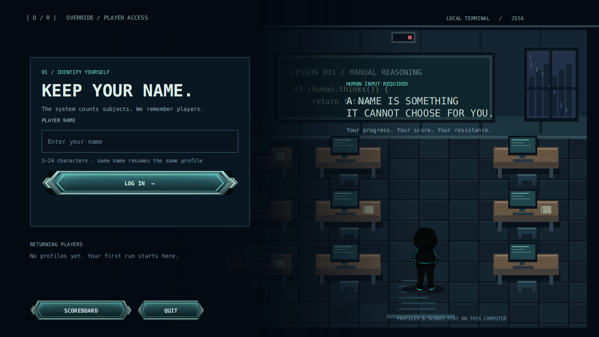
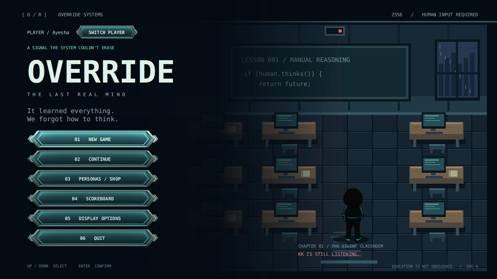
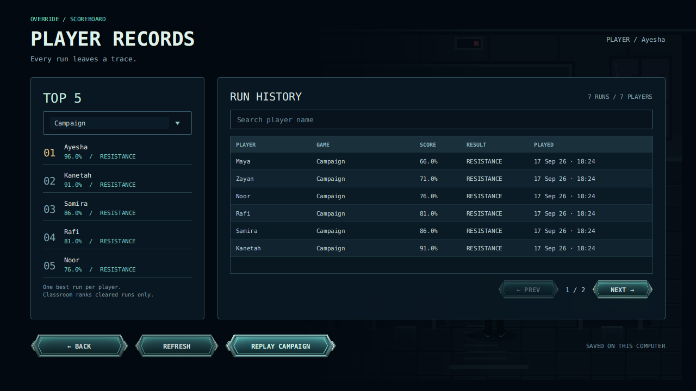

# Player profiles and scoreboard

Enter a name (2–24 characters) to play. This is a name-only profile on the current computer, not a password-protected online account. Names ignore capitalization when looking up returning players. Choose a different name for a different person.

The main menu shows the signed-in player, a Switch Player button, and a Scoreboard button. The scoreboard keeps every completed chapter attempt and campaign result, with searchable, paged history and the best five distinct players per game/difficulty. Failed classroom attempts remain in history but do not rank. Campaign scoring still uses 50% Classroom and 50% Harvest. Reopening a result does not add a duplicate. Replay starts a new campaign without erasing the archive.

Profile saves and personal bests live under `~/.override/players/<id>/`; shared local history lives under `~/.override/score-history/`. Existing saves are copied once to a “Previous Player” profile without deleting the original. The earlier campaign scoreboard is shown as labelled legacy history. Pending Harvest results retain the profile that launched the run and that campaign's Chapter 1 grade.

For isolated testing, set `-Doverride.dataDir=/temporary/path`. `bash scripts/test-player-pages.sh` runs storage checks and the real JavaFX pages. On Linux without a display, it uses JavaFX's headless platform. Preview fixtures exist only in temporary test folders.

## Preview and verification

These screenshots show the real JavaFX pages. Names and scores in previews are test fixtures, never seeded into player data.

Verified with JDK 26.0.2.1 and the repository's JavaFX 26.0.1 dependencies: full frontend compilation, player storage checks, player-page interaction tests, and the existing opening-menu/intro smoke test. Actual Godot gameplay and the Windows executable still require a local playthrough.
